# **InvestIQ – Application Fullstack Data (FastAPI, Docker, Finance Quantitative)**

Parys NOYON--MATHURIN

Élève ingénieure à l’ESIEE Paris – 5ᵉ année Data Science & Intelligence Artificielle

*Module* *Full Stack DATA*

## **Sommaire**

1. **Présentation générale**\
   1.1. Contexte académique\
   1.2. Choix du sujet : pourquoi une application de gestion de portefeuilles financiers ?
1. **Présentation de l’application InvestIQ**\
   2.1. Objectif fonctionnel\
   2.2. Stack technique\
   2.3. Principales fonctionnalités\
   2.4. Rôle des données de marché
1. **Architecture technique**\
   3.1. Schéma global de l’architecture\
   3.2. Structure interne du backend (FastAPI)\
   3.3. Description des composants\
   3.4. Cycle complet d’une requête utilisateur
1. **Choix algorithmiques**\
   4.1. Prétraitement des données\
   4.2. Rendements logarithmiques\
   4.3. Moyenne des rendements\
   4.4. Matrice de covariance\
   4.5. Définition du portefeuille\
   4.6. Optimisation Min-Variance\
   4.7. Optimisation Max-Sharpe\
   4.8. Calcul des métriques\
   4.9. Pipeline complet\
   4.10. Justification des choix
1. **Travail accompli vs attentes**\
   5.1. Exigences initiales → Implémentation réalisée\
   5.2. Fonctionnalités supplémentaires développées\
   5.3. Démonstration du bon fonctionnement tests\
   5.4.Frontend

1. **Difficultés rencontrées**\
   6.1. Docker\
   6.2. Organisation interne de l’API\
   6.3. Intégration de yfinance\
   6.4. Optimisation numérique\
   6.5. Validation des données\
   6.6. Mise en place de tests fiables
1. **Pistes d’amélioration**
   Conclusion

1. **Sources**\

## **1. Présentation générale**\

### 1\.1. Contexte académique

**InvestIQ** est une application web fullstack développée dans le cadre du module **E5 – DSIA 5102A**.

L’objectif de ce projet est de concevoir une application complète qui combine :

- un **backend API** robuste en **FastAPI**,
- une **base de données PostgreSQL** contenant les actifs, utilisateurs et portefeuilles,
- un **système d’authentification sécurisé** basé sur les tokens **JWT**,
- des **algorithmes d’optimisation financière** basés sur la théorie de Markowitz,
- une **gestion de données de marché** (prix historiques, rendements, covariance),
- et un **dashboard Streamlit** en interface utilisateur.

L’application offre un ensemble de fonctionnalités cohérentes autour de la **gestion de portefeuilles financiers**, notamment :

- **création d’un compte client** via une API sécurisée,
- **connexions JWT** permettant d’accéder aux routes protégées,
- **ajout et consultation d’actifs financiers**,
- **mise à jour des prix de marché** via fichiers CSV ou APIs externes,
- **optimisation de portefeuilles** (min-variance, max-Sharpe),
- **enregistrement**, **suppression** et **consultation** de portefeuilles optimisés.

L’application combine ainsi des aspects :

- **informatique** (API, BDD, sécurité, conteneurisation),
- **mathématiques** (statistiques, volatilité, covariance),
- **modélisation financière** (Markowitz, ratio de Sharpe),
- et **ingénierie logicielle** (tests, architecture, bonnes pratiques).

### 1\.2. Choix du sujet : pourquoi une application de gestion de portefeuilles financiers ?

J’ai volontairement orienté le projet vers la **finance quantitative**, car ce sujet :

- fait partie de mon parcours académique (option Finance semestre 1),
- permet de connecter de manière naturelle **Data Science** et **Finance**,
- et constitue un excellent terrain pour appliquer :
  - les statistiques (rendements, log-returns),
  - l’optimisation sous contraintes,
  - l’analyse de risque par covariance,
  - et la modélisation de portefeuilles.

Ce projet m’a obligée à mieux comprendre :

- la transformation des **prix → rendements**,
- le rôle de la **covariance** dans la diversification,
- la construction d’un portefeuille “efficace” au sens de Markowitz,
- l’interprétation des métriques annualisées (rendement, volatilité, Sharpe),
- et l’impact des contraintes (poids, bornes, absence de short-selling).

C’est donc **doublement formateur** :

|
**Axe**

|
**Ce qu’il m’a apporté**

|
| :-: | :-: |
|**Technique**|` ` maîtrise de FastAPI, PostgreSQL, Docker, JWT, tests|
|**Financier**|compréhension opérationnelle des modèles Markowitz / Sharpe|

## **2. Présentation générale de l’application InvestIQ**
### 2\.1. Objectif fonctionnel
Proposer à un utilisateur authentifié une allocation de portefeuille optimisée à partir d’une liste d’actifs financiers,** en s’appuyant sur la théorie de Markowitz (min-variance, max-Sharpe), tout en permettant de **sauvegarder** et **consulter** ces portefeuilles.

Concrètement, l’utilisateur peut :

- créer un compte et se connecter,
- définir une liste d’assets (par exemple : SPY, AGG, GLD, VNQ…),
- lancer une optimisation de type **min-variance** ou **max-Sharpe** sur ces actifs,
- stocker l’allocation obtenue dans son espace (portefeuilles),
- et consulter plus tard les portefeuilles qu’il a créé.

L’API est pensée pour être utilisée :

- soit directement via Swagger / Postman,
- soit par une interface front (un dashboard Streamlit) qui consommerait ces endpoints.
### 2\.2. Stack technique
- **Backend :**
  - Framework : **FastAPI**
  - Schémas de validation : **Pydantic**
  - ORM : **SQLAlchemy**
- **Base de données :**
  - **PostgreSQL**, orchestré via Docker
- **Sécurité :**
  - Authentification par **JWT** (JSON Web Token),
  - Hashage des mots de passe via **bcrypt** (Passlib).
- **Données de marché :**
  - Un fichier data/prices.csv servant de **fallback** (format long : date, ticker, adj\_close),
  - Des fonctions de mise à jour via des services de market data (Yahoo Finance / Stooq).
- **Conteneurisation :**
  - **Dockerfile** pour construire l’image de l’API,
  - **docker-compose.yml** pour lancer à la fois l’API et la base PostgreSQL.
- **Tests :**
  - Une **suite de tests automatisés** qui vérifie notamment le comportement de l’optimiseur (contraintes sur les poids, somme à 1, etc.).
### 2\.3. Principales fonctionnalités
Du point de vue utilisateur et métier, l’application InvestIQ fournit quatre grands blocs fonctionnels :

1. **Gestion des utilisateurs / authentification**
   1. Inscription : POST /auth/register\
      → création d’un utilisateur, stockage de l’email et du mot de passe hashé.
   1. Connexion : POST /auth/login\
      → vérification des identifiants et génération d’un token JWT.
   1. Utilisation du token :\
      → les endpoints sensibles (assets, optimize, portfolios, data/update) nécessitent un header Authorization: Bearer <token>.
1. **Gestion des actifs (assets)**
   1. L’utilisateur peut enregistrer des actifs financiers dans la base : ticker, nom, classe d’actif (equity, bond, gold, real\_estate, etc.).
   1. Endpoints typiques :
      1. GET /assets : liste des actifs disponibles,
      1. POST /assets : ajout d’un nouvel actif.
1. **Optimisation de portefeuilles**
   1. Endpoints principaux :
      1. POST /optimize/min-variance\
         → calcule un portefeuille de **variance minimale** sous contraintes de poids.
      1. POST /optimize/max-sharpe\
         → calcule un portefeuille **maximisant le Sharpe** à partir des rendements attendus et de la covariance.
   1. En entrée, l’utilisateur fournit :
      1. une liste de tickers,
      1. éventuellement une borne maximale par actif (ex : max\_weight = 0.6),
      1. et pour max-Sharpe, un taux sans risque.
   1. En sortie, l’API renvoie :
      1. une liste (ticker, weight) pour chaque actif,
      1. des métriques globales : rendement annualisé, volatilité annualisée, ratio de Sharpe.
1. **Gestion et stockage des portefeuilles**
   1. POST /portfolios : enregistrement d’un portefeuille optimisé (nom, tickers, weights, metrics),
   1. GET /portfolios : liste des portefeuilles d’un utilisateur,
   1. DELETE /portfolios/{id} : suppression d’un portefeuille.
   1. Les poids, tickers et métriques sont stockés de manière sérialisée, afin de pouvoir être rechargés et affichés par un client externe.

### 2\.4. Rôle des données de marché
Les calculs d’optimisation reposent sur des **prix historiques** :

- les prix sont convertis en **rendements logarithmiques**,
- les rendements servent à :
  - calculer les rendements moyens (mu),
  - la matrice de covariance (Σ),
  - dériver des indicateurs annualisés (en utilisant une fréquence de marché, par exemple 252 jours).

L’API prévoit :

- un endpoint POST /data/update pour mettre à jour le fichier de prix,
- un fichier CSV fallback data/prices.csv pour tester sans accès direct à internet.

Cela permet de séparer clairement :

- la **partie “data ingestion”** (récupération / mise à jour des données de marché),
- de la **partie “optimisation”** (calcul des poids optimaux à partir de ces données).

##  **3. Architecture Technique**
Elle s’organise autour de trois couches principales :

- une **API backend** développée en FastAPI,
- une **base de données PostgreSQL** orchestrée via Docker,
- un **dashboard utilisateur (Streamlit)** qui consomme l’API.

L’ensemble est conteneurisé, orchestré et isolé via un fichier docker-compose.yml.

-----
###  **3.1. Schéma global de l’architecture**
Voici une vision systémique de l’application :

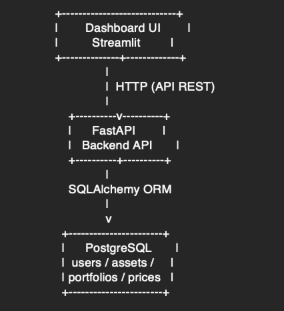 

Ce découpage permet :

- une séparation claire des responsabilités,
- une maintenance facilitée,
- une capacité d’évolution (ajout de nouvelles routes, optimisation, backtest…),
- une possibilité d’hébergement cloud (API stateless).

### **3.2. Structuration du projet**
### Arborescence complète du projet
## 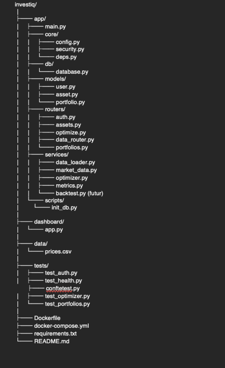 
##
##
### **3.3. Description détaillée des composants**
###  A. main.py — Point d’entrée de l’API
Rôle :

- instancier l’objet FastAPI,
- déclarer les routers,
- exposer un endpoint /health.

Structure :

app = FastAPI(title="InvestIQ")

app.include\_router(auth.router)

app.include\_router(assets.router)

app.include\_router(optimize.router)

app.include\_router(data\_router.router)

app.include\_router(portfolios.router)

-----
###  B. Dossier core/ — Configuration centrale
Contient les modules critiques :

|**Fichier**|**Rôle**|
| :-: | :-: |
|config.py|Variables d’environnement, URL BDD, secret JWT|
|security.py|Hashage (bcrypt), création + vérification JWT|
|deps.py|Dépendances réutilisables (ex : récupérer l’utilisateur courant)|

**C’est le cœur de la sécurité.**

-----
###  C. Dossier db/ — Connexion à PostgreSQL
Fichier principal : database.py

Contient :

- le moteur SQLAlchemy,
- la session DB,
- le Base servant pour les modèles,
- la dépendance get\_db() utilisée dans chaque router.

Exemple :

engine = create\_engine(settings.DATABASE\_URL)

SessionLocal = sessionmaker(bind=engine)

-----
### D\. Dossier models/ — Modèles SQLAlchemy
Trois tables essentielles :

|**Modèle**|**Champs principaux**|**Utilité**|
| :-: | :-: | :-: |
|User|email, password\_hash|Authentification|
|Asset|ticker, name, asset\_class|Universe d’actifs|
|Portfolio|user\_id, tickers, weights, metrics, created\_at|Sauvegarde des portefeuilles|

Chaque modèle hérite de Base.-----
### ` `E. Dossier routers/ — Endpoints REST
Chaque fichier correspond à un module fonctionnel :

|**Route**|**Rôle**|
| :-: | :-: |
|auth.py|Register + Login + Token|
|assets.py|CRUD des actifs|
|optimize.py|Markowitz min-variance & max-Sharpe|
|data\_router.py|Mise à jour de données marché|
|portfolios.py|Sauvegarde/listing/suppression|

**Points forts :**

- réponses typées avec Pydantic,
- endpoints sécurisés via Depends(get\_current\_user).
-----
### ` `F. Dossier services/ — Logique métier
Toute la logique financière et data est isolée ici.\
C’est important : **aucune logique métier dans les routers** → architecture propre.
#### *Composants principaux :*
- data\_loader.py : chargement depuis prices.csv
- market\_data.py : téléchargement Yahoo / Stooq
- metrics.py : log-returns, covariance, Sharpe annualisé
- optimizer.py : optimisation SLSQP
- backtest.py *(prévu)* : simulation d’un portefeuille dans le passé

Permet de séparer :

- *la data*,
- *les calculs*,
- *l’optimisation*.
-----
###  G. Dossier dashboard/ — Interface utilisateur
Streamlit permet à l’utilisateur de :

- se connecter,
- choisir ses tickers,
- télécharger les données,
- visualiser les allocations optimisées.

Le dashboard repose **100 % sur l’API**

-----
###  8. Conteneurisation : Dockerfile et docker-compose
#### *Dockerfile*
- utilise une image python:3.11-slim,
- installe les dépendances,
- expose le port 8000,
- exécute Uvicorn.
#### *docker-compose.yml*
Trois services :

services:

`  `db:

`    `image: postgres:15

`    `environment: ...

`  `api:

`    `build: .

`    `depends\_on: [db]

`    `ports: ["8000:8000"]

`  `dashboard:

`    `image: python:3.11-slim

`    `ports: ["8501:8501"]

Avantage :

- isolation,
- reproductibilité,
- démarrage automatique avec la BDD.

-----
### **3.4. Cycle complet d’une requête utilisateur**
Voici comment une requête parcourir le système, par exemple lors d’un appel à /optimize/min-variance :

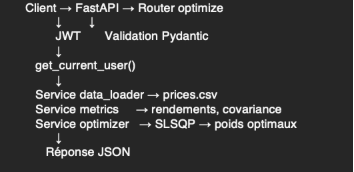 

Ce pipeline garantit :

- sécurité,
- modularité,
- lisibilité,
- testabilité.

# **– Notions préliminaires essentielles–**
Avant de présenter les choix algorithmiques, il est nécessaire d’introduire brièvement plusieurs notions financières utilisées dans les exemples (tickers, classes d’actifs, prix historiques, rendements).
## **1. Les tickers : SPY, AGG, GLD, VNQ**
Dans l’application, nous manipulons des codes tels que **SPY, AGG, GLD, VNQ**.\
Ce sont des **tickers**, c’est-à-dire des identifiants utilisés en bourse pour désigner un actif financier spécifique.

Ces tickers correspondent ici à des **ETF (Exchange Traded Funds)**, des fonds cotés très utilisés pour représenter de grandes classes d’actifs.
### 🟦 SPY — S&P 500 ETF (Actions américaines)
- Représente les 500 plus grandes entreprises américaines.
- Actif *actions* (le plus risqué parmi les quatre).
### 🟧 AGG — Aggregate Bond ETF (Obligations américaines)
- Panier diversifié d’obligations US (État + entreprises).
- Actif *obligataire*, moins risqué que les actions.
### 🟨 GLD — Gold ETF (Or physique)
- Réplique le prix de l’or.
- Actif de *couverture* utilisé pour réduire le risque global (safe haven).
### 🟩 VNQ — Real Estate ETF (Immobilier américain)
- Suit les grandes sociétés immobilières américaines (REITs).
- Actif *immobilier*, utile pour la diversification.

` `**Ces quatre actifs sont volontairement très différents.**\
Ils illustrent parfaitement l’effet de diversification utilisé par Markowitz.

### **2. Prix historiques : pourquoi les utilise-t-on ?**
Les données d’entrée de l’optimisation sont des **prix quotidiens** (souvent adj\_close = prix ajusté en fin de journée).

Exemple :

date, ticker, adj\_close

2024-01-02, SPY, 470.0

2024-01-03, SPY, 468.5

Ces prix ne sont **pas directement utilisables** :\
on doit les transformer en **rendements**, car ce sont les rendements qui décrivent la performance d’un actif.

### **3. Rendements et log-returns**
Un **rendement** mesure l’évolution du prix d’un actif d’un jour à l’autre.\
Dans InvestIQ, on utilise les **rendements logarithmiques** :

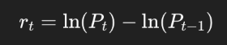

Pourquoi ?

- Ils sont plus stables,
- Ils s’additionnent naturellement dans le temps,
- Ils sont largement utilisés en finance quantitative.

C’est **à partir des rendements**, et non des prix, que l’on calcule :

- le rendement moyen,
- la volatilité,
- la covariance.
### **4. Diversification : idée centrale de Markowitz**
La diversification signifie :

*combiner plusieurs actifs différents pour réduire le risque global du portefeuille.*

Exemple :

- SPY (actions) et GLD (or) ne se comportent pas de la même façon.
- Quand les actions chutent, l’or peut monter → covariance faible ou négative.
- Donc un portefeuille combinant les deux peut être **moins risqué** qu’un portefeuille 100 % SPY.

C’est cette propriété que Markowitz exploite mathematiquement.

### **5. Covariance : mesurer comment les actifs bougent ensemble**
La **covariance** est une mesure statistique qui indique si deux actifs :

- montent ensemble (forte covariance),
- évoluent différemment (faible covariance),
- ont des comportements opposés (covariance négative).

Pour l’optimisation :

- covariance **élevée** → mauvaise diversification, risque plus élevé ;
- covariance **faible** → diversification efficace.

La matrice de covariance est **le cœur** du modèle Markowitz.

### **6. Ratio de Sharpe (pour max-Sharpe)**
Le ratio de Sharpe mesure :

*Le rendement obtenu pour une unité de risque prise.*

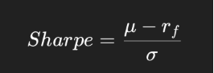

- μ = rendement du portefeuille,
- σ= risque du portefeuille,
- r\_f = taux sans risque (optionnel).

Plus le Sharpe est élevé :

- plus l’actif est “efficace”,
- meilleur est le compromis rendement/risque.

L’optimisation *max-sharpe* consiste à maximiser ce ratio.

### **7. Contraintes du portefeuille**
Pour obtenir un portefeuille réaliste, InvestIQ impose :

- **somme des poids = 1** (tout le capital investi),
- **poids ≥ 0** (pas de vente à découvert),
- **poids ≤ max\_weight** (évite qu’un seul actif domine).

Ces contraintes permettent d’obtenir un portefeuille :

- clair,
- équilibré,
- adapté à un utilisateur non-expert.  
  

## **4. Choix algorithmiques**
L’application repose principalement sur trois blocs mathématiques :

1. **le calcul des rendements historiques**,
1. **la construction des matrices statistiques (moyennes, covariance)**,
1. **l’optimisation sous contraintes (Markowitz)**
   1. **min-variance** (minimisation du risque)
   1. **max-Sharpe** (optimisation du couple rendement/risque)
-----
**4.1. Prétraitement des données de marché**

Les données sont fournies sous la forme d’un *CSV long* :

date, ticker, adj\_close

2024-01-02, SPY, 470.0

2024-01-02, AGG, 98.0

...

On les transforme en tableau *pivoté* :

date          SPY      AGG     GLD

2024-01-02    470.0    98.0    185.0

2024-01-03    468.5    98.1    186.2

...

Pourquoi ?\
Parce que les modèles financiers travaillent sur des **séries temporelles de prix alignés** pour chaque actif.

Cela garantit :

- que tous les prix correspondent aux mêmes dates,
- qu’il n’y a pas de trous dans les données,
- que les calculs vectorisés sont corrects (corrélations, covariances...).

### **4.2. Calcul des rendements logarithmiques**
Les modèles financiers ne travaillent pas directement sur les prix, mais sur les **variations de prix**,  rendements.

InvestIQ utilise les **rendements logarithmiques** :

En Python :

returns = np.log(prices / prices.shift(1)).dropna()

Le résultat est un DataFrame :

date        SPY      AGG      GLD

2024-01-03 -0.0032   0.0010   0.0064

2024-01-04  0.0080  -0.0020   0.0048

...

### **4.3. Moyenne des rendements (μ)**
Pour chaque actif, on calcule :

1. **la moyenne quotidienne** des rendements,

1. **le rendement annualisé**, en multipliant par 252 (jours de bourse par an)

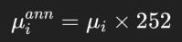 

(252 = nombre moyen de jours de bourse par an).Ces valeurs représentent une **estimation du rendement attendu** dans les modèles utilisés.
  

### **4.4. Matrice de covariance (Σ)**
La matrice de covariance est un élément central de la théorie de Markowitz :

On annualise la matrice :

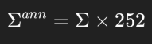

En code :

cov = returns.cov().values

### **4.5. Construction du portefeuille : vecteur de poids** 
Un portefeuille est une répartition de l’investissement sous forme d’un vecteur :

w=( w1,w2,...,wn)

Avec les contraintes suivantes :

- **la somme des poids = 1** (100 % du capital investi),
- **poids ≥ 0** (pas de vente à découvert — politique réaliste pour des débutants),
- **poids ≤ max\_weight** (pour éviter qu’un seul actif domine).

Ces contraintes rendent l’optimisation :\
✔ réaliste,\
✔ intuitive,\
✔ adaptée à une utilisation “ETF / portefeuille passif”.

### **4.6. Problème d’optimisation : Min-Variance**
### ` `Objectif : minimiser le risque total
Le risque du portefeuille est donné par :

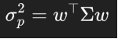

Le problème devient :

Sous les contraintes définies plus haut.
### Méthode : SLSQP
Le solveur utilisé (“Sequential Least Squares Programming”) est adapté parce qu’il :

- gère les contraintes d’égalité (somme = 1),
- gère les bornes (0 à max\_weight),
- est fiable pour les problèmes financiers convexes.

Extrait du code :

res = minimize(objective, x0, bounds=bounds, constraints=cons, method="SLSQP")

### **4.7. Problème d’optimisation : Max-Sharpe**

### Objectif : maximiser le ratio Sharpe
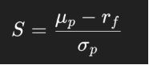

\
Dans le code, cela est transformé en **minimisation du Sharpe négatif** :

def neg\_sharpe(w):

`    `return - (port\_mu - rf) / port\_sigma

Avec les mêmes contraintes que Min-Variance.

### **4.8. Calcul des métriques du portefeuille**
### Une fois les poids obtenus :
###
### Rendement annualisé
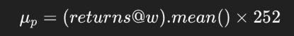
###
### Volatilité annualisée
### 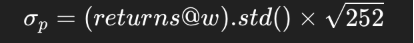
### Sharpe Ratio

Ces trois métriques sont renvoyées par l’API dans :

{

`  `"mu\_ann": ...,

`  `"vol\_ann": ...,

`  `"sharpe": ...

}

-----
### **4.9. Pipeline complet : Data → Optimisation**
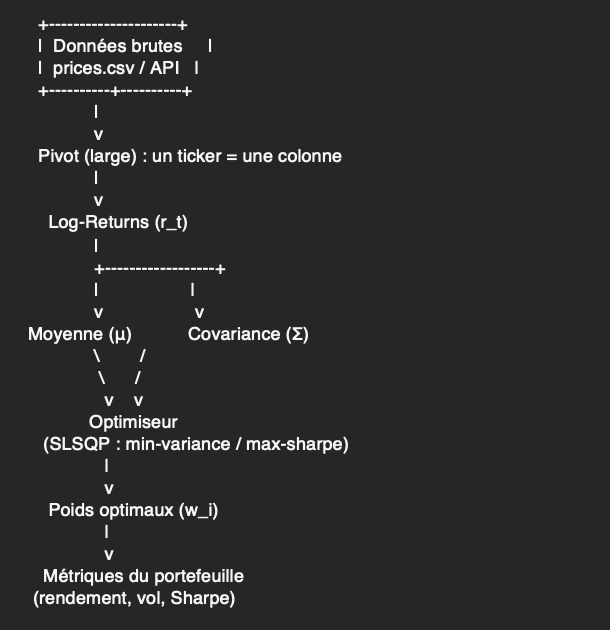

Ce pipeline est **propre, modulaire et industrialisable**.

### **4.10. Justification des choix algorithmiques**

|**Choix**|**Justification**|
| :-: | :-: |
|Log-returns|standard en finance, stabilité numérique|
|Covariance|base de la diversification|
|Sharpe|métrique canonique pour comparer les portefeuilles|
|SLSQP|gère bien les contraintes + bornes|
|Annualisation|cohérence avec les standards de marché|
|No short-selling|modèle adapté à des utilisateurs non professionnels|
|max-weight|limite la concentration excessive|
  

## **5. Travail accompli vs attentes**

### **5.1. Exigences initiales → Implémentation réalisée**

|**Exigence du module**|**Implémentation réalisée dans InvestIQ**|
| :-: | :-: |
|API REST structurée|Routes organisées en modules (auth, assets, optimize, portfolios, data/update)|
|Authentification sécurisée|JWT + hashage bcrypt + dépendance get\_current\_user()|
|Base de données relationnelle|PostgreSQL via Docker + modèles SQLAlchemy|
|Séparation logique|Architecture routers / services / models / core|
|Données financières|Fichier prices.csv + fallback Stooq/Yahoo|
|Optimisation Markowitz|Min-variance + Max-Sharpe|
|Conteneurisation|Dockerfile + docker-compose (API + DB + Dashboard)|
|Tests automatisés|Auth, optimisation, cohérence des poids, portfolios|
|Documentation|Swagger/OpenAPI auto-généré|
.

### **5.2. Fonctionnalités supplémentaires développées**

- Implémentation de **l’optimisation Max-Sharpe** .
- Ajout d’un **système complet de sauvegarde de portefeuilles**.
- Possibilité de **mettre à jour les données marché via une API externe**.
- Dashboard **Streamlit** consommant réellement l’API.

### **5.3. Démonstration du bon fonctionnement de l’application**
Cette section montre que l’API, les tests et le dashboard fonctionnent réellement.
#### **5.3.1. Fonctionnement des routes via Swagger**
#### A. Inscription d’un utilisateur (POST /auth/register)
Cette route permet de créer un nouvel utilisateur dans la base de données en fournissant une adresse email et un mot de passe. Lors de l’enregistrement :

- la validation Pydantic contrôle le format de l’email et du mot de passe,
- le mot de passe est automatiquement hashé via bcrypt,
- l’utilisateur est ajouté en base PostgreSQL,
- un **token JWT** est immédiatement généré et renvoyé dans la réponse.

\
*→ réponse* 

###

B. Connexion d’un utilisateur (POST /auth/login)

Cette route vérifie les identifiants fournis et renvoie un nouveau token JWT si la connexion est valide.

La réponse contient :

- un **access\_token** (JWT),
- le **token\_type : bearer**.

Ce test garantit que l’authentification fonctionne correctement et que les routes protégées ne seront accessibles qu’avec un token valide

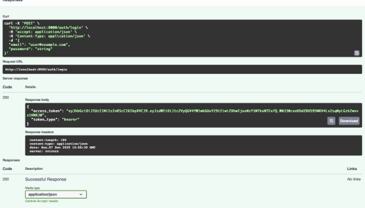

#### C. Ajout et consultation d’actifs (POST /assets et GET /assets)

 1\. Ajout d’un actif — POST /assets
L’utilisateur peut enregistrer un nouvel actif dans la base via un JSON contenant :

- ticker (ex : "SPY"),
- name (ex : "S&P 500 ETF"),
- asset\_class (ex : "equity").

Le test vérifie que :

- la route est protégée par JWT (requiert un token),
- la validation Pydantic fonctionne,
- l’actif est bien inséré dans PostgreSQL,
- l’objet renvoyé contient un id généré automatiquement.
-----
#### 2\. Consultation des actifs — GET /assets
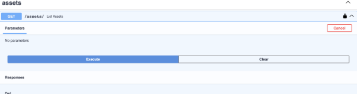

Cette route renvoie la liste complète des actifs stockés dans la base.

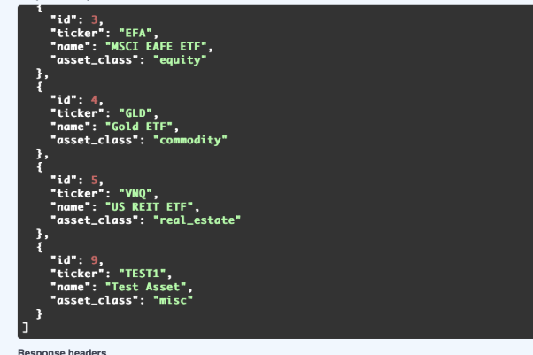

- les actifs ajoutés précédemment apparaissent correctement.
###
###
###
###
###

#### **D. Optimisation Min-Variance (POST /optimize/min-variance)**
Cette route applique le modèle de Markowitz dans le cas où l’objectif est **uniquement la minimisation du risque**, sans tenir compte du rendement.\
L’utilisateur fournit une liste d’actifs et une contrainte de poids maximal :

Lors de l’exécution, l’API :

1. charge les prix depuis prices.csv,
1. calcule les **log-returns**,
1. construit la matrice de **covariance Σ**,
1. résout le problème d’optimisation via **SLSQP** (contraintes de somme = 1 et absence de short-selling).

La réponse obtenue pour cet exemple est :

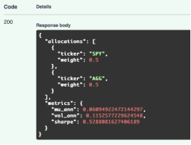

La réponse renvoie :

- une allocation cohérente (poids qui somment à 1),
- les métriques du portefeuille (rendement annualisé, volatilité, Sharpe).

  Autre Exemple : 

|Entrée|Réponse|
| :- | :- |
|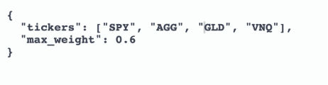||

### Interprétation du résultat
Dans un univers d’actifs faiblement corrélés, la solution optimale du problème Min-Variance est souvent une **allocation uniforme**, car elle maximise naturellement la diversification.\
Ce résultat confirme que l’optimiseur utilise correctement la matrice Σ : l’égalité des poids est un **résultat mathématique**, pas un comportement arbitraire de l’API.

#### **E. Optimisation Max-Sharpe (POST /optimize/max-sharpe)**
La route Max-Sharpe optimise le portefeuille selon le **ratio de Sharpe**, qui mesure la performance ajustée du risque.\
Contrairement à Min-Variance, cette approche introduit le rendement attendu dans l’objectif :

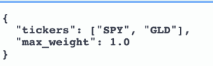

La réponse Swagger montre une allocation non uniforme :

#### Interprétation du résultat. 

Ici, les poids ne sont plus égaux :\
l’optimiseur surpondère **GLD**, car dans ton jeu de données, cet actif présente :

- un rendement annualisé plus élevé,
- une volatilité modérée,
- une corrélation faible avec SPY.

Ce comportement est attendu : **Max-Sharpe privilégie l’actif avec le meilleur rapport rendement/risque**.

Exemple de tout à l’heure

#### **Interprétation du résultat**
Ce résultat est particulièrement intéressant car il montre clairement que :

- **GLD est surpondéré (60 %)** → c’est l’actif avec le meilleur couple rendement/risque dans l’historique fourni par prices.csv.
- **SPY reçoit ~37 %** → bon rendement, volatilité modérée.
- **AGG tombe à ~3 %** → faible rendement attendu.
- **VNQ ≃ 0 %** → volatilité élevée ou rendement insuffisant, donc évincé par l’optimiseur.
- Le **ratio Sharpe final est élevé (≈ 2.33)**, indiquant un portefeuille extrêmement performant selon les données.
### Ce test démontre que :
- l’optimiseur tient compte **à la fois du rendement et de la covariance**,
- le solveur SLSQP applique correctement les contraintes (somme = 1, no short-selling, max\_weight),
- la réponse n'est **pas symétrique** : les poids reflètent réellement les caractéristiques statistiques des actifs,
- la route Max-Sharpe fonctionne différemment de Min-Variance et apporte une valeur ajoutée claire.
-----
### **E. Gestion des portefeuilles (POST /portfolios, GET /portfolios, DELETE /portfolios/{id})**
La section *portfolios* regroupe l’ensemble des routes permettant à un utilisateur authentifié de sauvegarder, consulter et supprimer des portefeuilles optimisés.

-----
#### **E.1. Enregistrement d’un portefeuille (POST /portfolios)**
Lorsqu’un utilisateur obtient une allocation via /optimize/min-variance ou /optimize/max-sharpe, il peut la stocker dans son espace via :

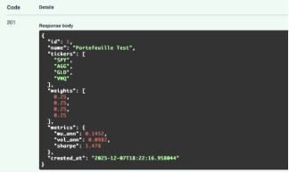

-----
#### **E.2. Consultation des portefeuilles (GET /portfolios)**
*(→ insérer la capture de la liste des portefeuilles)*

Cette route retourne l’ensemble des portefeuilles sauvegardés par l’utilisateur connecté.\
La réponse se présente sous la forme d’une liste JSON :

Ce test confirme que :

- la route GET fonctionne et renvoie uniquement les portefeuilles du bon utilisateur,
- la sérialisation JSON est correcte,
- les flottants et tableaux sont restitués exactement comme stockés.

-----

#### **E.3. Suppression d’un portefeuille (DELETE /portfolios/{id})**
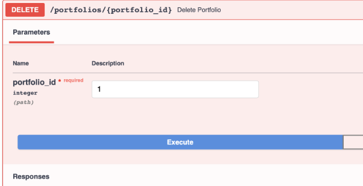La suppression d’un portefeuille se fait via l’ID fourni dans la liste précédente (1 dans notre cas)\
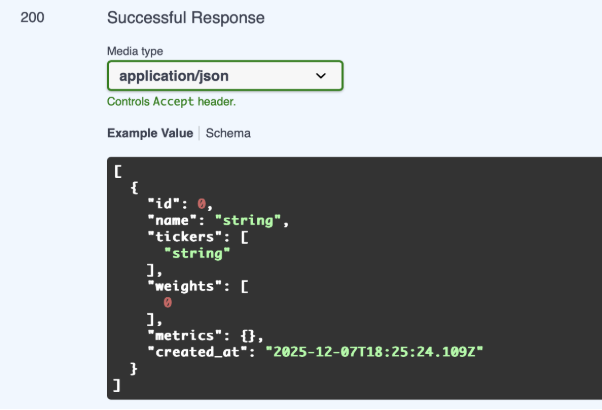

-----
### ` `**F. Mise à jour des données de marché (POST /data/update)**
Cette route permet de mettre à jour les prix utilisés par l’optimiseur.\
Elle accepte plusieurs sources : yahoo, stooq, ou auto (fallback : CSV).

-----
#### **F.1. Exemple de requête (POST /data/update)**

|<h2>**Entrée**</h2>|<h2>**Sortie**</h2>|
| :-: | :-: |
|<h2></h2>|<h2></h2>|
-----
#### **F.2. Fonctionnement**
À l’appel de cette route, l’API :

1. tente de télécharger les prix via Yahoo Finance,
1. en cas d’échec → bascule automatiquement sur Stooq,
1. si les deux échouent → utilise un fallback local (prices.csv).

La réponse renvoie :

- les tickers effectivement mis à jour,
- la source utilisée,
- le message de validation.

### **5.3.2. Tests automatisés (Pytest)**
# 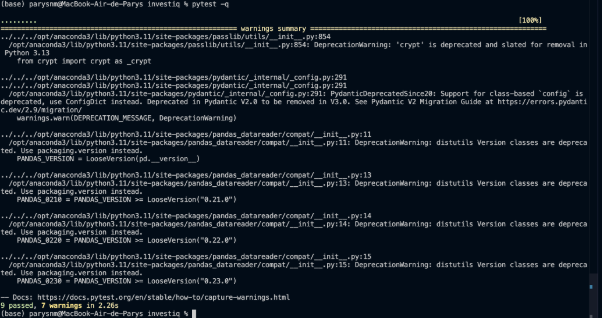
#
|**Nom du test**|**Rôle du test** |
| :-: | :-: |
|**test\_register\_success**|Vérifie qu’un utilisateur peut s’inscrire correctement.|
|**test\_login\_success**|Vérifie qu’un utilisateur peut se connecter et recevoir un token JWT.|
|**test\_login\_invalid\_credentials**|Vérifie que de mauvais identifiants renvoient une erreur.|
|**test\_health**|Vérifie que l’API répond correctement via /health.|
|**test\_min\_variance\_success**|Vérifie que l’optimisation min-variance retourne des poids et des métriques valides.|
|**test\_min\_variance\_unauthorized**|Vérifie que la route min-variance est protégée et inaccessible sans token.|
|**test\_optimizer\_min\_variance**|Vérifie que les poids min-variance respectent les contraintes mathématiques (somme = 1, poids ≥ 0).|
|**test\_create\_portfolio\_success**|Vérifie qu’un portefeuille peut être créé et correctement enregistré en base.|
|**test\_list\_portfolios**|Vérifie que l’utilisateur peut récupérer la liste de ses portefeuilles.|
|**test\_delete\_portfolio\_success**|Vérifie qu’un portefeuille existant peut être correctement supprimé.|

## **5.4. Frontend**
Le frontend a été initié sous la forme d’un **dashboard Streamlit** permettant d’interagir avec l’API FastAPI :

- connexion d’un utilisateur via un token,
- sélection d’une liste d’actifs,
- lancement d’une optimisation Min-Variance ou Max-Sharpe,
- affichage des allocations obtenues.

Ce module montre que l’API est exploitable par une interface web, mais **le frontend n’est pas finalisé** :

- l’interface actuelle ne comporte que des écrans de base,
- aucune navigation complète n'a encore été implémentée,
- certaines fonctionnalités (authentification persistante, graphiques, historique des portefeuilles) restent incomplètes,
- les éléments visuels sont provisoires.
#
# 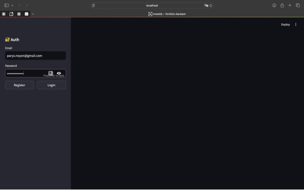
# 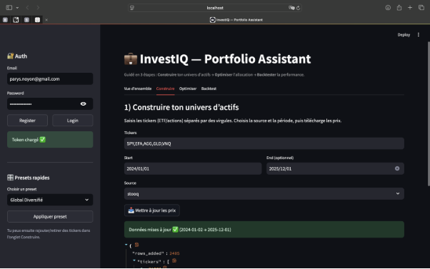
# 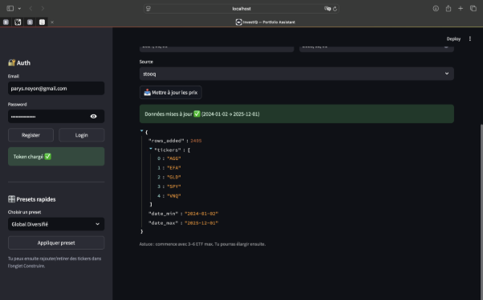

- *Max-Sharpe* : aperçu de l’allocation obtenue\
  **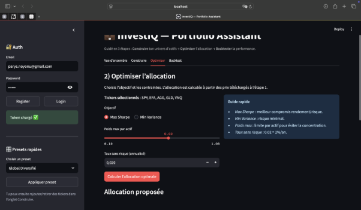**

# 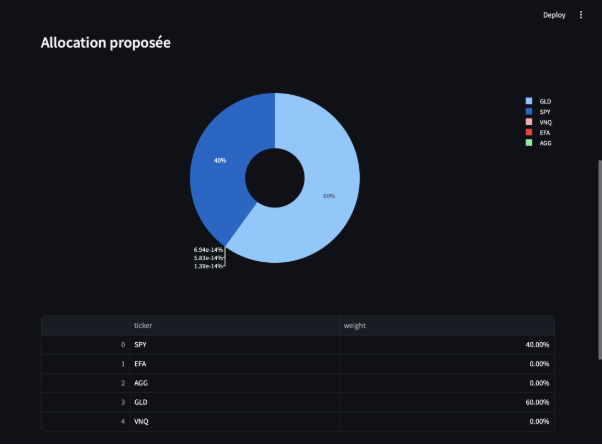

*Min-Variance* : aperçu de la répartition optimale minimale de risque
# 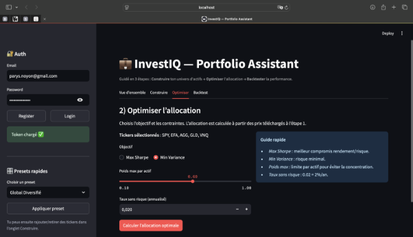
# 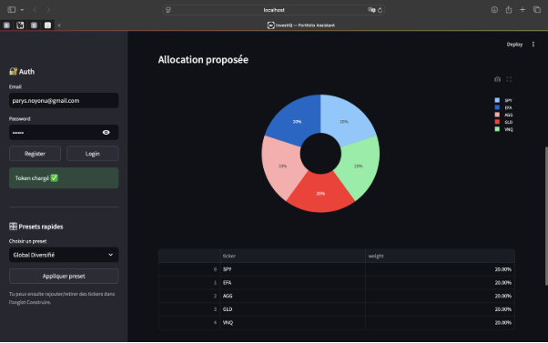

# **Backtest pas encore implementés**
# 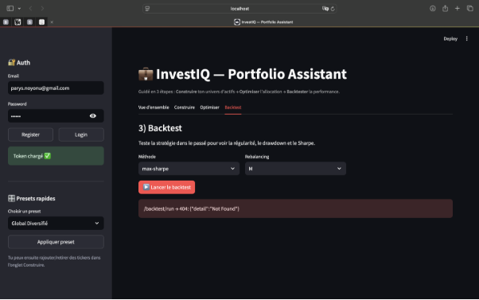

# **6. Difficultés rencontrées**
## **6.1. Difficultés liées à Docker**
### 6\.1.1. Ordre de démarrage (race condition)
Le conteneur FastAPI démarrait parfois plus vite que PostgreSQL.

**Conséquences :**

- la création des tables échouait,
- SQLAlchemy renvoyait une erreur de connexion,
- l’API se lançait sans base prête.

Ce problème n’apparaissait pas en local (PostgreSQL démarre très vite) mais était systématique en environnement Docker.

**Solution mise en place :**\
Ajout d’un script *wait-for-db* utilisant netcat :

until nc -z db 5432; do sleep 1; done;

→ Le conteneur API attend désormais que PostgreSQL soit réellement disponible avant d’exécuter l’init DB puis Uvicorn.\
Cela a rendu le système beaucoup plus stable et reproductible.

-----
### 6\.1.2. Gestion des volumes
Il arrivait que la base conserve des schémas obsolètes entre deux builds, provoquant des incohérences.

**Solution :**\
Utilisation de : docker compose down -v

pour repartir sur une base propre, puis recréation automatique des tables via Base.metadata.create\_all.

-----
### 6\.1.3. Variables d’environnement
Certaines variables définies dans .env n’étaient pas chargées dans les conteneurs.

**Solution :**\
Définir explicitement les valeurs dans docker-compose.yml et centraliser la configuration dans config.py.

-----
## **6.2. Structuration interne de l’API**
Au début, plusieurs routes contenaient une partie de la logique métier (chargement des données, calculs, validations). Cela compliquait :

- la maintenance,
- les tests,
- et la lisibilité globale.

La solution a été d’adopter une architecture claire en couches :

- routers/ pour les endpoints,
- services/ pour la logique métier,
- models/ pour la BDD,
- core/ pour la sécurité et les dépendances.
-----
## **6.3. Intégration de yfinance : problèmes persistants**
C’est l’un des points les plus difficiles du projet.
### 6\.3.1. Problème initial : yfinance refusait de fonctionner correctement en Docker
Ce comportement s’explique par plusieurs facteurs :

1. yfinance repose sur des appels HTTP vers Yahoo Finance, qui échouent parfois en environnement conteneurisé.
1. Le module renvoie régulièrement des *multi-index* instables.
1. Les images légères (comme python:3.11-slim) manquent de certaines dépendances réseau.

Pour garantir la reproductibilité du projet (notamment pour Pytest), il a été décidé de :

- baser l’application sur un CSV local stable (prices.csv),
- garder /data/update comme optionnel,
- utiliser un fallback plus fiable.
-----
### 6\.3.2. Mise en place d’un fallback fiable : Stooq
Pour les utilisateurs souhaitant mettre à jour leurs prix :

- le module peut utiliser Stooq via pandas\_datareader,
- beaucoup plus fiable que yfinance,
- moins sensible aux multi-index,
- moins sujet aux timeouts.

Aujourd’hui, l’API suit cette logique :

1. Essaye Yahoo Finance.
1. Si échec → bascule automatiquement sur Stooq.
1. Sinon → utilise le CSV local.

Ce mécanisme garantit la continuité même quand yfinance pose problème.

-----
## **6.4. Optimisation numérique (SLSQP)**
Les difficultés mathématiques ont été réelles, notamment :
### 6\.4.1. Instabilité du solveur
Le solveur SLSQP est sensible aux matrices de covariance mal conditionnées (ce qui arrive souvent avec peu de données).

**Problèmes rencontrés :**

- convergence impossible,
- message « Inequality constraints incompatible »,
- poids négatifs dus au bruit numérique.
### 6\.4.2. Solutions appliquées
- projection des poids négatifs vers 0,
- normalisation systématique w = w / w.sum(),
- vérification des contraintes via tests unitaires,
- bornes strictes [0, max\_weight] pour éviter les solutions aberrantes.

Ces ajustements ont été nécessaires pour produire :

- des poids réalistes,
- une convergence rapide,
- et une optimisation stable à partir du CSV.
-----
## **6.5. Validation des données et cohérence statistique**
Les points délicats ont été nombreux :

- alignement des séries temporelles lors du pivot,
- suppression des lignes incomplètes,
- gestion des tickers inexistants,
- cohérence des colonnes du CSV.

Par exemple : si l’utilisateur envoyait un ticker absent du CSV, l’API renvoyait une erreur peu explicite.\
Des validations strictes Pydantic ont donc été ajoutées pour garantir :

- la cohérence des tickers envoyés,
- la cohérence de la somme des poids,
- la cohérence entre tickers et weights.
-----
## **6.6. Mise en place de tests fiables**
Les tests ont demandé la construction d’un environnement isolé :

- utilisation de SQLite pour les tests,
- override dynamique de get\_db(),
- création et suppression des tables avant/ après chaque test.

Cette configuration garantit des tests unitaires rapides, indépendants et reproductibles.

-----

## **7. Pistes d’amélioration**

**7.1. Améliorations du dashboard Streamlit**

Finir le dashboard

**Évolutions possibles :**

- visualisation de la frontière efficiente,
- heatmap des corrélations,
- meilleure navigation entre étapes,

ajout d’un module d’aide à l’interprétation du portefeuille** 

-----
**7.2. Backtesting complet**

L’étape la plus attendue pour compléter l’application est l’ajout d’un module de backtesting.

**Évolutions possibles :**

- reconstruction de la courbe d’équité dans le temps,
- calcul automatique d’indicateurs : CAGR, volatilité, Sharpe, max drawdown,
- rebalancing (mensuel, trimestriel, annuel),
- comparaison avec un benchmark (ex. SPY ou portefeuille 60/40).

**Intérêt :** valider le comportement du portefeuille sur plusieurs années et renforcer l’aspect décisionnel de l’application.

-----
**7.2. Intégration d’APIs financières fiables**

L’utilisation d’un CSV local garantit la stabilité, mais limite l’aspect “réel”.\
À terme, il serait pertinent d’intégrer une API financière externe plus robuste que yfinance.

**Possibilités :**

- Finnhub, Alpha Vantage, Polygon.io, Tiingo,
- fallback multi-sources en cas d’échec réseau.

**Intérêt :** disposer de données actualisées et améliorer la crédibilité du modèle.

-----
**7.3. Système multi-portefeuilles avancé**

La gestion actuelle permet d’enregistrer des portefeuilles, mais peut être enrichie.

**Extensions envisageables :**

- versionning des portefeuilles (historique des optimisations),
- comparaison de plusieurs stratégies (min-variance vs max-sharpe),
- ajout d’un portefeuille “réel” et calcul automatique du rééquilibrage,
- profil utilisateur (prudent, équilibré, dynamique).

**Intérêt :** proposer une expérience plus personnalisée et plus proche d’un robo-advisor.

-----
**7.4. Améliorations de l’optimisation**

Le modèle Markowitz peut être étendu vers des approches plus avancées.

**Idées d’amélioration :**

- optimisation à rendement cible,
- contraintes supplémentaires (secteurs, limites par actif, tracking error),
- modèle Black-Litterman pour stabiliser les allocations.

**Intérêt :** obtenir des portefeuilles plus réalistes et mieux contrôlés.

-----
**7.5. Industrialisation et CI/CD**

Pour professionnaliser davantage le projet :

- pipeline CI/CD (build, tests, Docker),
- monitoring basique (logs structurés),
- tests de charge (locust).

**Intérêt :** rendre le projet fiable, facile à déployer et prêt pour un usage réel.

# **Conclusion**
Ce projet m’a permis de développer une application  de gestion de portefeuilles, avec une API fonctionnelle, sécurisée et structurée autour de FastAPI, PostgreSQL et Docker. J’ai appliqué la théorie de Markowitz à travers deux optimisations (Min-Variance et Max-Sharpe) et mis en place un système d’authentification, de gestion d’actifs et de portefeuilles. Le travail m’a également confrontée à des problèmes réels — intégration des données, stabilité du solveur, organisation de l’API — que j’ai pu résoudre en renforçant l’architecture et les tests. Le frontend reste partiel.

## 8. Source

Aide de chat gpt pour le rapport et la construction des fichiers de l’application

*Les données de marché utilisées pour les optimisations proviennent de deux sources principales :*\
– *Yahoo Finance (via la bibliothèque yfinance)*\
– *Stooq (fallback plus stable en cas d'erreur réseau)*
2

